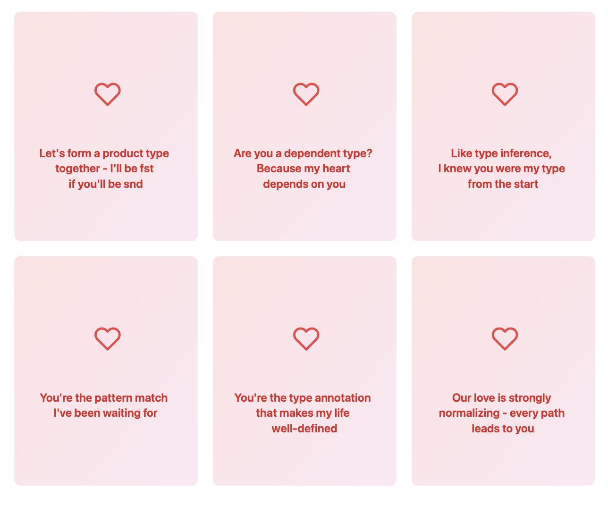

# Type Theory Valentines

## Valentines

- "Let's form a product type together - I'll be fst if you'll be snd"
- "Are you a dependent type? Because my heart depends on you"
- "Like type inference, I knew you were my type from the start"
- "You're the pattern match I've been waiting for"
- "You're the type annotation that makes my life well-defined"
- "Our love is strongly normalizing - every path leads to you"

Find each card image in cards directory.

## Contributing
I'm looking for more PL themed love messages. Please make a PR!

## License

MIT License 